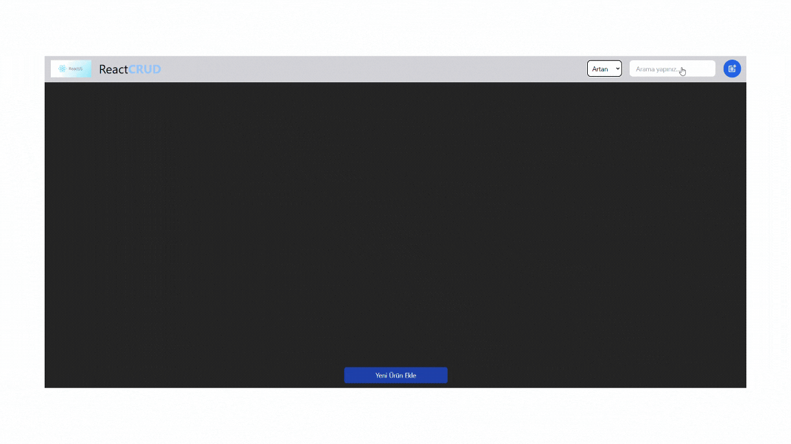

# Redux Modal

This project is a job tracking application featuring a modal structure built with Redux Toolkit. The application enables users to manage their job applications with functionalities like add, delete, update, and filter.

## Features

- Add, delete, and update job applications
- Filter applications by status and type
- Responsive UI with Tailwind CSS
- Navigation with React Router DOM
- Modern icons using React Icons

## Technologies Used

- **Redux Toolkit**
- **React Redux**
- **React Router DOM**
- **React Icons**
- **Tailwind CSS**

## Live Demo

